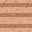
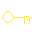
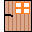
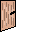

# Coding Garden Summer 2022

## RogueLike Game By Ruslan Karabalin

| Symbol | Description | Sprite                                   |
|--------|-------------|------------------------------------------|
| @      | Player      |     |
| E      | Enemy       |      |
| %      | Food        |       |
| #      | Wall        |       |
| &      | Cat-Wife    |        |
| -      | Key         |        |
| \>     | Next Door   |  |

[//]: # (| \<     | Previous Door | |)

---

### The player has: health points(HP), damage points(DP), current number of steps(Steps), the maximum number of steps for all levels(Max Steps), rating points(Social Credits).

### At each level there is a door that will take you to the next level, to remove the obstacle in front of the door, pick up the "Key". Some levels have a door that will take you back to the previous level.

### To win you need to go through all 4 levels.

### You can lose if your health becomes 0, or if your current steps exceed the maximum number of steps.

+ Use arrow keys to move
+ Eat Food to restore HP
+ Kill Enemy and earn Social Credits
+ Enter to Next Door and go to the next level(there are 4 levels in total)

---
> Special Features:
> 1. Cheat System (try press WASD on level 0 and in settings)
> 2. Enemy can eat food
> 3. Wife feed you and restore your HP
